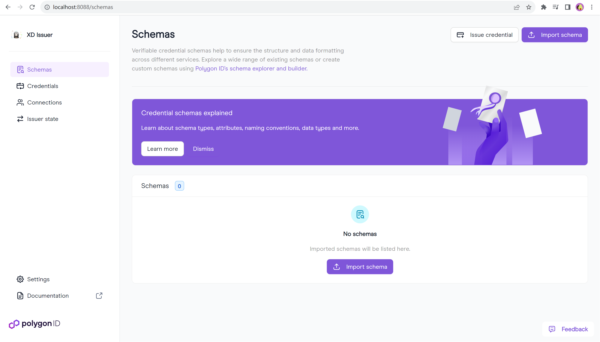
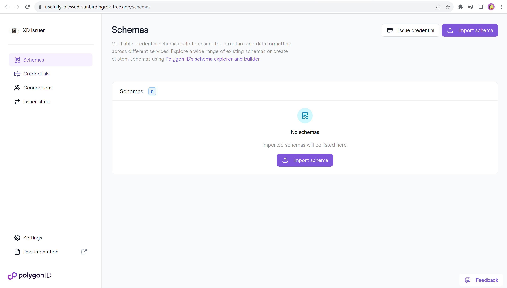

# Running the system for the first time

## Common steps

1. Install git on linux system. I am using windows subsystem for linux (WSL) on windows 11.

2. Clone the repository

```bash
git clone https://github.com/Xiaod0ng/zkKYC-Issuer
```

3. Update `ISSUER_ETHEREUM_URL` variable in .env-issuer. I'm using Alchemy here.

4. Follow [docker documentation](https://docs.docker.com/desktop/wsl/) to turn on Docker Desktop for WSL

5. Run `make up` in Linux terminal

6. Run the following command to add vault toekn to configuration file
```bash
make add-vault-token
```

7. Run the following command to set private key
```bash
make private_key=<YOUR_WALLET_PRIVATE_KEY> add-private-key;
```

8. Run the following command to generate a new issuer DID
```bash
make generate-issuer-did
```

9. Run `make run-ui` to start the webpage

After the above steps, http://localhost:8088 should work properly.



## Public URLs setup

Open network tab when loading the UI page, you can find that UI page is calling UI API for schemas and status.


To allow connection from Polygon ID wallet, you need to make both UI API (:3002) and UI (:8088) public. For temporary testing purpose, I am using ngrok and localtunnel to establish the public URLs. 

1. In `.env-issuer`, edit `ISSUER_SERVER_URL` to ngrok static domain. In my case, the variable value is `https://usefully-blessed-sunbird.ngrok-free.app/`. You need to set your own value. Related ngrok documentation can be found [here](https://ngrok.com/docs/getting-started/?os=windows). 

2. In `.env-api`, edit `ISSUER_API_UI_SERVER_URL` to localtunnel public URL. In my case, the variable value is `https://xd-issuer.loca.lt`. You need to set your own value. Related localtunnel documentation can be found [here](https://theboroer.github.io/localtunnel-www/).

3. Run `make restart-ui` to restart the docker services since the environment variables are changed.

4. Open a local terminal with administrator rights (localtunnel may return error if not with admin rights), run `lt --subdomain xd-issuer --port 3002` to establish issuer API public URL. You need to use your own value.

5. Open `https://xd-issuer.loca.lt`, follow the instructions on the page to whitelist the IP address.

6. After finishing the above steps, open ngrok terminal, run `ngrok http --domain usefully-blessed-sunbird.ngrok-free.app 8088` to start ngrok public URL. You need to use your own value.

7. Open `https://usefully-blessed-sunbird.ngrok-free.app` in the browser, it should be like this. 



# Not the first time

## Remove services and start again

1. Run `make down` to remove existing services

2. Run `make up` to start the services

3. Run `make delete-did` to remove current DID

4. Delete the value of ISSUER_API_UI_ISSUER_DID in .env-api

5. Run `make generate-issuer-did` to generate a new issuer DID

6. Run `make run` to start API

7. Run `make run-ui` to start UI

8. Follow [Public URLs setup](#public-urls-setup) to expose the public access.


## Resume from last time

If all variables are configured properly, you need to follow the steps below.

1. Start Docker Desktop

2. Go to the issuer-node folder, run `docker rm issuer-ui-1` to remove the image first, then run `make restart-ui` to start the ui again. This is caused by the issue illustrated [here](https://github.com/0xPolygonID/issuer-node/pull/542). 

3. Follow [Public URLs setup](#public-urls-setup) to expose the public access.

You should be able to navigate the sites.

-------------------------------------------------------
After v2.3.1, the issue has been fixed. Just start docker services and establish the public URLs.


# Possible Problems

1. Network error after starting UI

    Usually because there are docker images not running. Make sure `make run` is executed before `make run-ui` so that the API image is properly initiated. Check docker logs for more information. Some related information in this [issue](https://github.com/0xPolygonID/issuer-node/issues/520)

2. ngrok returns ERR_NGROK_3200 error

    Close the terminal and run again.

3. localtunnel returns server error

    Run the terminal with administrator rights.
